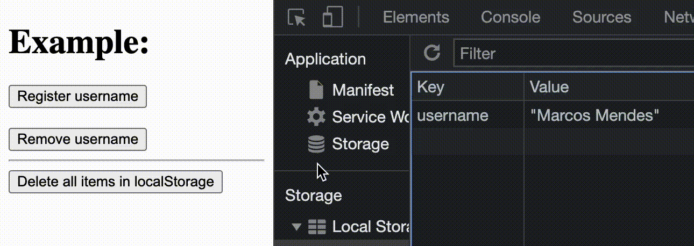

# useLocalStorage

A simple and effective React Hook to manage the localStorage
<br />



## Links

- [Github](https://github.com/iamdevmarcos/useLocalStorage)

## Installation

This module is distributed via [npm](https://www.npmjs.com/package/react-screen-size-helper) which is bundled with node and
should be installed as one of your project's `dependencies`.

## Important

The hook provides some functions to better and improve your developer experience:

- `getStorageItem`: get an item from LocalStorage
- `setStorageItem`: register an item on the LocalStorage
- `removeStorageItem`: remove an item from the LocalStorage
- `clearStorage`: clear all values in the LocalStorage

## Example

```jsx
import React from 'react'
import { useLocalStorage } from 'useLocalStorage'

const App = () => {
  const {
    getStorageItem,
    setStorageItem,
    removeStorageItem,
    clearStorage
  } = useLocalStorage()

  return (
    <div>
      <h1>Example:</h1>

      <button onClick={() => setStorageItem('username', 'Marcos Mendes')}>
        Register username
      </button>
      <br />
      <br />

      <button onClick={() => removeStorageItem('username')}>
        Remove username
      </button>
      <hr />

      <button onClick={() => clearStorage()}>
        Delete all items in localStorage
      </button>
    </div>
  )
}

export default App
```
## Issues

Looking to contribute? Look for the [Good First Issue](https://github.com/iamdevmarcos/useLocalStorage/issues) label.

### 🐛 Bugs

Please file an issue for bugs, missing documentation, or unexpected behavior.

### 💡 Feature Requests

Please file an issue to suggest new features. Vote on feature requests by adding
a 👍. This helps maintainers prioritize what to work on.

## LICENSE

[MIT](LICENSE)
